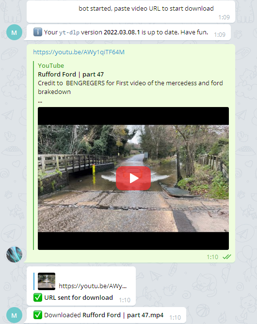
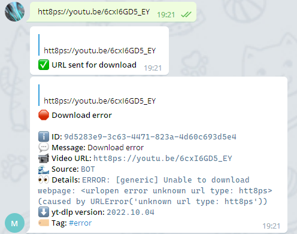

## yt-dlp-bot
Simple and reliable YouTube Download Telegram Bot.



## 😂 Features 
* Download videos from any [yt-dlp](https://github.com/yt-dlp/yt-dlp) supported website
* Upload downloaded videos to the Telegram chat
* Trigger video download by sending link to an API
* Track download tasks via API

## ⚙ Quick Setup
1. Create Telegram bot using [BotFather](https://t.me/BotFather) and get your `token`
2. [Get your Telegram API key](https://my.telegram.org/apps) (`api_id` and `api_hash`)
3. [Find your Telegram User ID](https://stackoverflow.com/questions/32683992/find-out-my-own-user-id-for-sending-a-message-with-telegram-api)
4. Copy `bot/config-example.yml` to `bot/config.yml`
5. Write `token`, `api_id`, `api_hash` to `bot/config.yml` by changing respective placeholders
6. Write your Telegram user id to the `allowed_users` -> `id` by replacing dummy value and change or remove `forward_group_id` value (if you want to forward the video to some group when upload is enabled)
7. Check the default environment variables in `envs/.env_common` and change if needed
8. Video storage path (`STORAGE_PATH` environment variable) is located in the `envs/.env_worker` file
By default, it's `/filestorage` path inside the container. What you want is to map the real path to this inside the `docker-compose.yml` file for `worker` service, e.g.
if you're on Windows, next strings mean container path `/filestorage` is mapped to
real `D:/Videos` so your videos will be saved to your `Videos` folder.
   ```yml
     worker:
       ...
       volumes:
         - "D:/Videos:/filestorage"
   ```
9. If you want your downloaded video to be uploaded back to Telegram, set `upload_vide_file`
config variable for your user in the `config.yml` to `True`

## 🏃 Run
```bash
# Build base image
docker compose build base-image

# Build and run all services in detached mode
docker compose up --build -d -t 0 && docker compose logs --tail 100 -f

# Stop all services
docker compose stop -t 0
```

Your telegram bot should send you a startup message:
`✨ <YOUR_BOT_NAME> started, paste video URL to start download` and that's it.
After pasting video URL(s) bot will send you appropriate message whether they were downloaded or something went wrong.


## Advanced setup
1. If you want to change `yt-dlp` download options, go to the `worker/ytdl_opts`
directory, copy content from `default.py` to `user.py` and modify as you wish 
by checking [available options](https://github.com/yt-dlp/yt-dlp/blob/master/yt_dlp/YoutubeDL.py#L180).

## 🛑 Failed download
If your URL can't be downloaded for some reason, you will see this



## Access
 - **API**: default port `1984` and no auth. Port can be changed in `docker-compose.yml`
 - **RabbitMQ**: default creds are located in `envs/.env_common`
 - **PostgreSQL**: default creds are located in `envs/.env_common`. Same creds are stored for Alembic in `alembic.ini`.

## API
By default, API service will run on your `localhost` and `1984` port.
API endpoint documentations lives at `http://127.0.0.1:1984/docs`.

| Endpoint | Method| Description|
|---|---|---|
| `/status` | `GET` | Get API healthcheck status, usually response is `{"status": "OK"}` |
| `/v1/yt-dlp` | `GET` | Get latest and currently installed `yt-dlp` version |
|`/v1/tasks/?include_meta=False&status=DONE`| `GET` | Get all tasks with filtering options like to include large file metadata and by task status: `PENDING`, `PROCESSING`, `FAILED` and `DONE`. |
| `/v1/tasks/f828714a-5c50-45de-87c0-3b51b7e04039?include_meta=True` | `GET` | Get info about task by ID |
| `/v1/tasks/latest?include_meta=True` | `GET` | Get info about latest task |
| `/v1/tasks/f828714a-5c50-45de-87c0-3b51b7e04039` | `DELETE` | Delete task by ID |
| `/v1/tasks/latest?include_meta=True` | `GET` | Get info about the latest task |
| `/v1/tasks` | `POST` | Create a download task by sending json payload `{"url": "<URL>"}` |
| `/v1/tasks/stats` | `GET` | Get overall tasks stats |

### API examples
1. `GET http://localhost:1984/v1/tasks/?include_meta=False&status=DONE&limit=2&offset=0`

    Response
    ```json
    [
        {
            "id": "7ab91ef7-461c-4ef6-a35b-d3704fe28e6c",
            "url": "https://youtu.be/jMetnwUZBJQ",
            "status": "DONE",
            "source": "BOT",
            "added_at": "2022-02-14T02:29:55.981622",
            "created": "2022-02-14T02:29:57.211622",
            "updated": "2022-02-14T02:29:59.595551",
            "message_id": 621,
            "file": {
                "id": "4b1c63ed-3e32-43e6-a0b7-c7fc8713b268",
                "created": "2022-02-14T02:29:59.597839",
                "updated": "2022-02-14T02:29:59.597845",
                "name": "Ana Flora Vs. Dj Brizi - Conversa Fiada",
                "ext": "mp4"
            }
        },
        {
            "id": "952bfb7f-1ab3-4db9-8114-eb9995d0cf8d",
            "url": "https://youtu.be/AWy1qiTF64M",
            "status": "DONE",
            "source": "API",
            "added_at": "2022-02-14T00:36:21.398624",
            "created": "2022-02-14T00:36:21.410999",
            "updated": "2022-02-14T00:36:23.535844",
            "message_id": null,
            "file": {
                "id": "ad1fef96-ce1c-4c5e-a426-58e2d5d3e907",
                "created": "2022-02-14T00:36:23.537706",
                "updated": "2022-02-14T00:36:23.537715",
                "name": "Rufford Ford | part 47",
                "ext": "mp4"
            }
        }
    ]
    ```
2. `POST http://localhost:1984/v1/tasks`

    Request
    ```json
    {
        "url": "https://youtu.be/AWy1qiTF64M"
    }
    ```
    Response
    ```json
    {
        "id": "5ac05808-b29c-40d6-b250-07e3e769d8a6",
        "url": "https://youtu.be/AWy1qiTF64M",
        "source": "API",
        "added_at": "2022-02-14T00:35:25.419962+00:00"
    }
    ```
3. `GET http://localhost:1984/v1/tasks/stats`

    Response
    ```json
    {
        "total": 39,
        "unique_urls": 5,
        "pending": 0,
        "processing": 0,
        "failed": 26,
        "done": 13
    }
    ```
